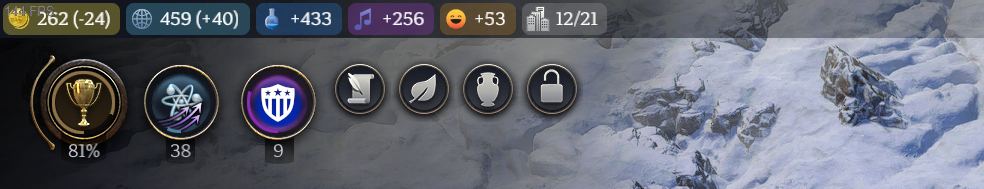

# zhekoff's Colorful Top Panel

A **Civilization VII** mod that improves the top panel with colorful backgrounds for yields for better visual communication and a more vibrant UI.

## Installation

1. Download the latest release.
2. Extract the contents into your `{user}\AppData\Local\Firaxis Games\Sid Meier's Civilization VII\Mods` folder.

## Compatibility

The mod was made for 1.0.1 Patch 3, however it is modularized and it should not make any conflicts with other mods that modify the same files.

## Links

* [CivFanatics Download Link](https://forums.civfanatics.com/resources/zhekoffs-colorful-top-panel.31964/)
